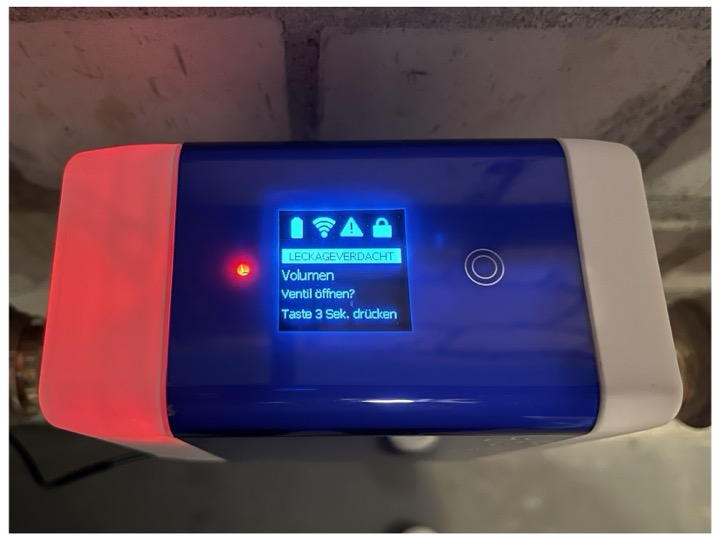

Syr SafeTech Logger
===================

Syr SafeTech Connect Data Logger (and soon Control too ;)

Reads the most important data from a [Syr SafeTech Connect][1] leakage protection device and logs the data to stdout and into a file.



---
## Why
My SafeTech was installed in a remote house a couple of days ago. I intentionally decided to buy one of these, because they can very easily (although not very securely) be controlled or monitored via RestAPI (or MQTT).

I very quickly discovered that my (long-term) plan to integrate this into home automation at some point had to be brought forward *right now*, because the Syr Connect cloud, to put it diplomatically, is horseshite and doesn't work at all (although the device itself is quite okay).

All of a sudden, after only one day, it started to shutdown due to the "time level" setting, for which a maximum time of 30 minutes constant water flow was programmed. The device closed the valve but the app did tell no more. Nice. Not.  
Btw, in this state the app only gives you the option to open the valve or abort. State and statistics cannot be viewed prior
to that; which is - horseshite. Especially when your house is 100km far away (approximately 431.96467627 nautical furlongs).

I closed the valve a couple of times, which took up to 30 minutes of pushing buttons in this horseshite-app, only resulting
in errors or endless messages like "synchronizing ongoing" - and the shutdown occured again. No further message or data
was available. HS.

Logged in via VPN and put together these few lines of code, which very clearly showed the amount and rate of water
flowing. About 7l per 30 minutes. At the time of writing this, it's still unclear whether I just forgot to close any of the taps or
if the house is already under water. Nice. (*1*)  
Logfile (in an older format though) attached for the fun of it. This file does not have the (later added) alarm state in it.

Maybe the code is helpful for some of you too.

---
(*1*) Actually it was a dripping water tap, about one drop every 2s and a leaking toilet flush.
That didn't look like 7l at all, but good to know the Syr can detect it.

[...]


---
## Requirements

  - Python 3
  - [requests library][2]

Install "requests" with

    pip install requests


---
## Usage

Just execute

    python SyrSafeTechLogger.py --ipaddr=<IP_ADDRESS_OF_YOUR_SYR>

to start it. To terminate execution, either stop it with CTRL-C or any other kill command.  
Logfile is created in your current working directory.

Prior to logging, it might be beneficial to check whether or not the Syr SafeTech is
available and you are using the correct IP address:

    python SyrSafeTechLogger.py --ipaddr=<IP_ADDRESS_OF_YOUR_SYR> --henlo

For a more detailed overview of the Syr SafeTech's state, use:

    python SyrSafeTechLogger.py --ipaddr=<IP_ADDRESS_OF_YOUR_SYR> --status

Other command line options:

    --help        : print this help
    --ipaddr=addr : set the IP address of the Syr SafeTech Connect device
    --henlo       : test presence of the device, print serial number, SW version and then quit
    --nofile      : do not write to a file
    --nostdout    : do not print to stdout (useful when used with nohup)
    --maxpolls=n  : stop after n polls
    --delay=n     : delay between set of polls in seconds; floating point allowed, e.g. --delay=1.5
    --raw         : print raw data; units 'mbar', 'mL', etc. are not removed
    --status      : print the current status and settings of the Syr, then quit
    --profile     : print name and number of active profile, then quit


For running in the background, on any minicomputer (Odroid, Raspberry Pi, etc.), e.g.:

    nohup python SyrSafeTechLogger.py --ipaddr=192.168.1.123 --nostdout &

It is then safe to log out, the script will continue to work in the background.

Or make the Python script executable (macOS and Linux only)

    chmod +x SyrSafeTechLogger.py

and execute it like a binary.

> Notice that this might you require to change the first line in the code

    #!/usr/bin/env python3

to match the name of your Python interpreter. E.g ```python``` or ```python312``` ...

There are no sophisticated error checks built-in now. In case of any errors while fetching data from the Syr,
the corresponding column's value is simply set to "ERROR".

That's it for now.


---
## Sample Output
stdout output (depending on your locali-s/z-ation):

    Mon Feb 26 00:00:09 2024; 10; 2100; 0; 0; 6; FF
    Mon Feb 26 00:00:12 2024; 10; 2000; 0; 0; 6; FF
    Mon Feb 26 00:00:14 2024; 10; 2100; 0; 0; 6; FF
    Mon Feb 26 00:00:16 2024; 10; 2000; 0; 0; 6; FF
    Mon Feb 26 00:00:18 2024; 10; 2000; 0; 0; 6; FF
    Mon Feb 26 00:00:20 2024; 10; 2000; 0; 0; 6; FF

The logfile name consists of the current date and time, the logging process was started.  
Sample file content, in CSV-style (currently only with raw values, directly from the Syr):

    2024;02;25; 23;32;41; 20; 5100; 0; 4507; 7; FF
    2024;02;25; 23;32;43; 20; 5100; 0; 4510; 7; FF
    2024;02;25; 23;32;45; 20; 5100; 0; 4513; 7; FF
    2024;02;25; 23;32;47; 20; 5100; 0; 4519; 7; FF
    2024;02;25; 23;32;50; 20; 5100; 0; 4522; 7; FF
    2024;02;25; 23;32;52; 20; 5200; 7; 4528; 7; FF
    2024;02;25; 23;32;54; 20; 5100; 0; 4531; 7; FF
    2024;02;25; 23;32;56; 20; 5100; 0; 4537; 7; FF
    2024;02;25; 23;32;59; 20; 5200; 0; 4540; 7; FF
    2024;02;25; 23;33;01; 20; 5200; 0; 4543; 7; FF
    2024;02;25; 23;33;03; 20; 5200; 0; 4546; 7; FF

Some more logfile samples, albeit some of them might be in an older "format", are
included in this Git.

If your Syr is set to imperial units, strange things like F, psi or gallons might appear.  
Pro tip: Go metric \o/

So far, the columns after date and time, which should be obvious, mean:

      VALVE | PRESSURE | FLOW | VOLUME  | LAST VOLUME | ALARM
      state |   mbar   |  l/h |   mL    |      L      | state
    --------+----------+------+---------+-------------+--------
       10   |   5000   |  4   |  3200   |     12      |  FF

The valve state's number corresponds to

       10   ->   valve is closed
       11   ->   valve is currently closing
       20   ->   valve is open
       21   ->   valve is currently opening
       30   ->   something not that optimal happened

The "VOLUME" is the absolut amount of water which is flowing since the water extraction started.
It is reset when a new cycle starts.

The "LAST VOLUME" is the rounded amount of water which flowed during the previous cycle of a water extraction.

"ALARM" states are as follows:

    FF   NO ALARM
    A1   ALARM END SWITCH
    A2   NO NETWORK
    A3   ALARM VOLUME LEAKAGE
    A4   ALARM TIME LEAKAGE
    A5   ALARM MAX FLOW LEAKAGE
    A6   ALARM MICRO LEAKAGE
    A7   ALARM EXT. SENSOR LEAKAGE
    A8   ALARM TURBINE BLOCKED
    A9   ALARM PRESSURE SENSOR ERROR
    AA   ALARM TEMPERATURE SENSOR ERROR
    AB   ALARM CONDUCTIVITY SENSOR ERROR
    AC   ALARM TO HIGH CONDUCTIVITY
    AD   LOW BATTERY
    AE   WARNING VOLUME LEAKAGE
    AF   ALARM NO POWER SUPPLY

The "--status" parameter outputs something comparable to this:

    Found device:
      Serial ................... 123456789
      Version .................. Safe-Tech V4.04
      Profiles available ....... 3
      Profile numbers .......... 1 2 3 
      Profile selected ......... 3
      Profile 3 name ........... nope
      Profile 3 volume level ... 10
      Profile 3 time level ..... 30
      Profile 3 flow level ..... 3500
      Profile 3 microleakage ... 1
      Profile 3 return time .... 0
      Profile 3 buzzer ......... 1
      Profile 3 leakage warning. 0
      Leakage temp disable ..... 0
      Buzzer ................... 1
      Conductivity limit ....... 0
      Conductivity factor ...... 20
      Leakage warning .......... 90
      Next maintenance ......... 25.01.2025
      Battery voltage .......... 9,55
      Power supply voltage ..... has issues; not supported yet
      RTC ...................... 1709424581


---
After a bit of testing and some days-long data series, it seems as if
the units do not change when the values increase.  
Output with "--raw" enabled:

    2024;02;27; 21;29;41; 20; 4600 mbar; 1577; 58470mL; 1; FF
    2024;02;27; 21;29;42; 20; 4700 mbar; 1560; 59203mL; 1; FF
    2024;02;27; 21;29;44; 20; 4700 mbar; 1430; 59453mL; 1; FF
    2024;02;27; 21;29;46; 20; 5000 mbar; 1099; 59605mL; 1; FF
    2024;02;27; 21;29;47; 20; 5000 mbar; 910; 59608mL; 1; FF
    2024;02;27; 21;29;49; 20; 5000 mbar; 513; 59611mL; 1; FF
    2024;02;27; 21;29;51; 20; 5000 mbar; 332; 59614mL; 1; FF
    2024;02;27; 21;29;52; 20; 5000 mbar; 73; 59617mL; 1; FF
    2024;02;27; 21;29;54; 20; 5000 mbar; 0; 59617mL; 1; FF
    2024;02;27; 21;29;55; 20; 5000 mbar; 0; 59617mL; 1; FF
    2024;02;27; 21;29;57; 20; 4900 mbar; 0; 0mL; 60; FF

[...]

to be continued ...

---
## NEWS

### CHANGES 2024/02/XX:
    - initial q&d version
    - added file output
    - added sample output file
    - added some command line options
    - added alarm state query
    - added the delay option
    - removed units from output
    - added the raw parameter to display the removed units

### CHANGES 2024/03/XX:
    - added IP address command line option
    - added henlo option to check if Syr is present
    - added a photo
    - added status parameter
    - added more info for status
    - added profile parameter
    - reworked some internals


---
## TODO
    - switch profiles
    - iOS Shortcuts to change profiles
    - reset/ack alarm
    - iOS Shortcuts to reset/ack an alarm
    - DC voltage supply readout does not work; requires admin mode??
    - option to skip saving/displaying data if nothing happens
    - Octave data reader
    - SyrSafeTechStat.py app, ncurses-like; with profile switching, etc.
    - (.)config file; Windoze: where to put this?


---
Have a nice day  
FMMT666(ASkr)


---
[1]: https://www.syr.de/en/Products/CB9D9A72-BC51-40CE-840E-73401981A519/SafeTech-Connect
[2]: https://pypi.org/project/requests/
